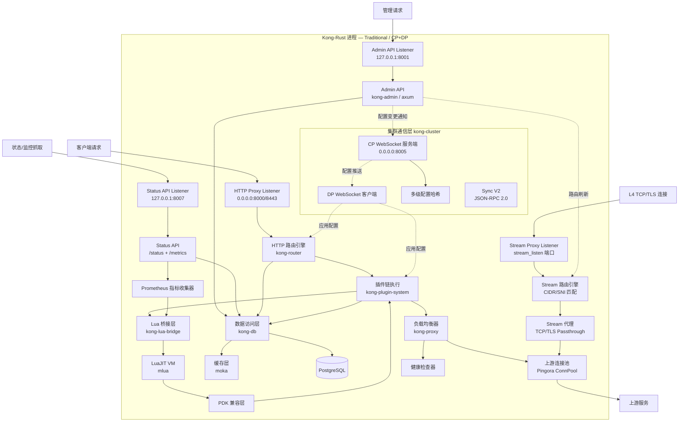
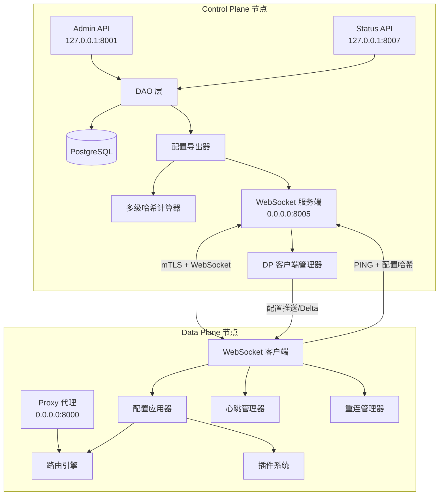

# 设计文档：Kong-Rust

## 概述

Kong-Rust 是 Kong API 网关的 Rust 重写版本，基于 Cloudflare Pingora 框架构建。设计目标是完全替换 Kong，保持所有数据模型、Admin API、配置格式和 Lua 插件接口的 100% 兼容性。

**核心设计原则：**
- **兼容优先**：所有外部行为（API、配置、插件接口）与 Kong 完全一致
- **Rust 原生**：核心代理引擎、路由匹配、数据库访问等用 Rust 实现，追求极致性能
- **Lua 桥接**：通过 mlua + LuaJIT 运行现有 Lua 插件，提供完整 PDK 兼容层

## 代码复用分析

### 现有组件复用

- **Pingora**：复用其 HTTP 代理引擎、连接池、TLS 管理、负载均衡、健康检查框架
- **Kong 源码（/Users/dawxy/proj/kong）**：作为行为参考，确保所有模型定义、API 行为、路由匹配规则完全一致
- **Kong 内置 Lua 插件**：直接加载运行，不做修改

### 关键 Rust 依赖

| Crate | 用途 |
|-------|------|
| `pingora` | HTTP 代理引擎核心 |
| `pingora-proxy` | 反向代理 trait 和生命周期 |
| `pingora-load-balancing` | 负载均衡算法 |
| `pingora-cache` | 代理缓存（可选） |
| `mlua` | Lua/LuaJIT 绑定，运行 Lua 插件 |
| `tokio` | 异步运行时（Pingora 内置） |
| `sqlx` | PostgreSQL 异步数据库驱动 |
| `axum` | Admin API HTTP 框架 |
| `serde` / `serde_json` | 序列化/反序列化 |
| `uuid` | UUID 生成 |
| `regex` | 路由正则匹配 |
| `tracing` | 结构化日志和追踪 |
| `moka` | 高性能内存缓存 |

## 架构

### 整体架构



> **Hybrid 模式说明：** Traditional 模式下所有组件在同一进程运行。Hybrid 模式下 CP 节点运行 Admin API + 集群服务端（不运行 Proxy），DP 节点运行 Proxy + 集群客户端（不运行 Admin API，不连接数据库）。

### Workspace 结构

```
kong-rust/
├── Cargo.toml                    # workspace 根配置
├── kong.conf.default             # 默认配置（兼容 Kong 格式）
├── crates/
│   ├── kong-core/                # 核心数据模型和 trait
│   │   ├── src/
│   │   │   ├── lib.rs
│   │   │   ├── models/           # Service, Route, Consumer 等模型
│   │   │   ├── traits/           # 插件 trait、DAO trait
│   │   │   └── error.rs          # 统一错误类型
│   │   └── Cargo.toml
│   ├── kong-config/              # 配置解析（兼容 kong.conf）
│   │   ├── src/
│   │   │   ├── lib.rs
│   │   │   ├── parser.rs         # kong.conf 解析器
│   │   │   └── env.rs            # KONG_* 环境变量处理
│   │   └── Cargo.toml
│   ├── kong-db/                  # 数据库 DAO 层
│   │   ├── src/
│   │   │   ├── lib.rs
│   │   │   ├── dao/              # 各实体 DAO
│   │   │   ├── schema.rs         # Schema 验证
│   │   │   ├── cache.rs          # 多级缓存
│   │   │   └── dbless.rs         # db-less 模式
│   │   └── Cargo.toml
│   ├── kong-router/              # 路由引擎
│   │   ├── src/
│   │   │   ├── lib.rs
│   │   │   ├── traditional.rs    # 传统路由匹配
│   │   │   ├── expressions.rs    # 表达式路由
│   │   │   └── priority.rs       # 优先级排序
│   │   └── Cargo.toml
│   ├── kong-proxy/               # 基于 Pingora 的代理引擎
│   │   ├── src/
│   │   │   ├── lib.rs
│   │   │   ├── server.rs         # Pingora Server 配置
│   │   │   ├── service.rs        # HttpProxy trait 实现
│   │   │   ├── balancer.rs       # 负载均衡
│   │   │   └── health_check.rs   # 健康检查
│   │   └── Cargo.toml
│   ├── kong-plugin-system/       # 插件框架
│   │   ├── src/
│   │   │   ├── lib.rs
│   │   │   ├── registry.rs       # 插件注册表
│   │   │   ├── iterator.rs       # 插件链迭代执行
│   │   │   ├── phases.rs         # 生命周期阶段定义
│   │   │   └── config.rs         # 插件配置验证
│   │   └── Cargo.toml
│   ├── kong-lua-bridge/          # Lua 兼容层
│   │   ├── src/
│   │   │   ├── lib.rs
│   │   │   ├── vm.rs             # LuaJIT VM 管理（per-worker 池）
│   │   │   ├── pdk/              # PDK 接口实现
│   │   │   │   ├── mod.rs
│   │   │   │   ├── request.rs    # kong.request
│   │   │   │   ├── response.rs   # kong.response
│   │   │   │   ├── service.rs    # kong.service
│   │   │   │   ├── client.rs     # kong.client
│   │   │   │   ├── log.rs        # kong.log
│   │   │   │   ├── ctx.rs        # kong.ctx
│   │   │   │   ├── cache.rs      # kong.cache
│   │   │   │   ├── router.rs     # kong.router
│   │   │   │   ├── node.rs       # kong.node
│   │   │   │   └── ip.rs         # kong.ip
│   │   │   ├── loader.rs         # Lua 插件加载器
│   │   │   ├── schema.rs         # Lua schema 解析
│   │   │   └── ngx_compat.rs     # ngx.* API 兼容层
│   │   └── Cargo.toml
│   ├── kong-admin/               # Admin API
│   │   ├── src/
│   │   │   ├── lib.rs
│   │   │   ├── app.rs            # axum 应用定义
│   │   │   ├── handlers/         # 各实体 handler
│   │   │   │   ├── mod.rs
│   │   │   │   ├── services.rs
│   │   │   │   ├── routes.rs
│   │   │   │   ├── consumers.rs
│   │   │   │   ├── upstreams.rs
│   │   │   │   ├── targets.rs
│   │   │   │   ├── plugins.rs
│   │   │   │   ├── certificates.rs
│   │   │   │   ├── info.rs       # /, /status, /endpoints
│   │   │   │   ├── schemas.rs    # /schemas/*
│   │   │   │   ├── tags.rs
│   │   │   │   ├── cache.rs
│   │   │   │   ├── debug.rs
│   │   │   │   └── clustering.rs # /clustering/status
│   │   │   ├── pagination.rs     # 分页逻辑
│   │   │   ├── error.rs          # 错误响应格式（兼容 Kong）
│   │   │   └── validation.rs     # 请求验证
│   │   └── Cargo.toml
│   ├── kong-cluster/             # 集群通信层（Hybrid CP/DP）
│   │   ├── src/
│   │   │   ├── lib.rs
│   │   │   ├── role.rs           # ClusterRole 枚举
│   │   │   ├── cp/               # Control Plane 实现
│   │   │   │   ├── mod.rs
│   │   │   │   ├── ws_server.rs  # WebSocket 服务端
│   │   │   │   ├── config_push.rs # 配置导出/推送
│   │   │   │   ├── client_manager.rs # DP 客户端管理
│   │   │   │   └── hash.rs       # 多级配置哈希
│   │   │   ├── dp/               # Data Plane 实现
│   │   │   │   ├── mod.rs
│   │   │   │   ├── ws_client.rs  # WebSocket 客户端
│   │   │   │   ├── config_apply.rs # 配置接收/应用
│   │   │   │   ├── heartbeat.rs  # PING/PONG 心跳
│   │   │   │   └── reconnect.rs  # 断线重连
│   │   │   ├── sync_v2/          # 增量同步
│   │   │   │   ├── mod.rs
│   │   │   │   ├── rpc.rs        # JSON-RPC 2.0 协议
│   │   │   │   ├── delta.rs      # Delta 计算/应用
│   │   │   │   └── version.rs    # 版本号管理
│   │   │   └── tls.rs            # TLS 双向认证
│   │   └── Cargo.toml
│   └── kong-server/              # 主入口二进制
│       ├── src/
│       │   └── main.rs           # 启动入口
│       └── Cargo.toml
└── lua/                          # Lua 插件目录（从 Kong 复制或指向）
    └── kong/
        └── plugins/              # 内置 Lua 插件
```

## 组件和接口

### 组件 1：kong-core — 核心数据模型

**职责：** 定义所有与 Kong 完全一致的核心数据结构和 trait 接口。

**核心模型（与 Kong Schema 完全一致）：**

```rust
// Service 模型 — 对应 Kong services 表
pub struct Service {
    pub id: Uuid,
    pub name: Option<String>,
    pub protocol: Protocol,          // http, https, tcp, tls, udp, grpc, grpcs
    pub host: String,
    pub port: u16,                   // 默认 80
    pub path: Option<String>,
    pub retries: i32,                // 默认 5
    pub connect_timeout: i32,        // 默认 60000ms
    pub write_timeout: i32,          // 默认 60000ms
    pub read_timeout: i32,           // 默认 60000ms
    pub client_certificate: Option<Uuid>,
    pub tls_verify: Option<bool>,
    pub tls_verify_depth: Option<i32>,
    pub ca_certificates: Option<Vec<Uuid>>,
    pub enabled: bool,               // 默认 true
    pub tags: Option<Vec<String>>,
    pub created_at: i64,
    pub updated_at: i64,
}

// Route 模型 — 对应 Kong routes 表
pub struct Route {
    pub id: Uuid,
    pub name: Option<String>,
    pub protocols: Vec<Protocol>,     // 默认 [http, https]
    pub methods: Option<Vec<String>>,
    pub hosts: Option<Vec<String>>,
    pub paths: Option<Vec<String>>,
    pub headers: Option<HashMap<String, Vec<String>>>,
    pub snis: Option<Vec<String>>,
    pub sources: Option<Vec<CidrPort>>,
    pub destinations: Option<Vec<CidrPort>>,
    pub strip_path: bool,             // 默认 true
    pub preserve_host: bool,          // 默认 false
    pub request_buffering: bool,      // 默认 true
    pub response_buffering: bool,     // 默认 true
    pub https_redirect_status_code: u16, // 默认 426
    pub service: Option<ForeignKey>,
    pub regex_priority: i32,          // 默认 0
    pub path_handling: PathHandling,  // v0 或 v1
    pub expression: Option<String>,
    pub priority: Option<i32>,
    pub tags: Option<Vec<String>>,
    pub created_at: i64,
    pub updated_at: i64,
}

// Consumer 模型
pub struct Consumer {
    pub id: Uuid,
    pub username: Option<String>,
    pub custom_id: Option<String>,
    pub tags: Option<Vec<String>>,
    pub created_at: i64,
    pub updated_at: i64,
}

// Upstream 模型
pub struct Upstream {
    pub id: Uuid,
    pub name: String,
    pub algorithm: LbAlgorithm,       // round-robin, least-conn, consistent-hashing, latency
    pub hash_on: HashOn,
    pub hash_fallback: HashOn,
    pub hash_on_header: Option<String>,
    pub hash_on_cookie: Option<String>,
    pub hash_on_cookie_path: Option<String>,
    pub hash_on_query_arg: Option<String>,
    pub hash_on_uri_capture: Option<String>,
    pub hash_fallback_header: Option<String>,
    pub hash_fallback_query_arg: Option<String>,
    pub hash_fallback_uri_capture: Option<String>,
    pub slots: i32,                   // 默认 10000
    pub healthchecks: HealthcheckConfig,
    pub tags: Option<Vec<String>>,
    pub host_header: Option<String>,
    pub client_certificate: Option<Uuid>,
    pub use_srv_name: bool,
    pub created_at: i64,
    pub updated_at: i64,
}

// Target 模型
pub struct Target {
    pub id: Uuid,
    pub upstream: ForeignKey,
    pub target: String,               // host:port
    pub weight: i32,                  // 默认 100
    pub tags: Option<Vec<String>>,
    pub created_at: i64,
    pub updated_at: i64,
}

// Plugin 模型
pub struct Plugin {
    pub id: Uuid,
    pub name: String,
    pub enabled: bool,
    pub service: Option<ForeignKey>,
    pub route: Option<ForeignKey>,
    pub consumer: Option<ForeignKey>,
    pub config: serde_json::Value,    // 动态配置
    pub protocols: Vec<Protocol>,
    pub tags: Option<Vec<String>>,
    pub ordering: Option<PluginOrdering>,
    pub instance_name: Option<String>,
    pub created_at: i64,
    pub updated_at: i64,
}

// Certificate 模型
pub struct Certificate {
    pub id: Uuid,
    pub cert: String,                 // PEM 格式
    pub key: String,                  // PEM 格式
    pub cert_alt: Option<String>,
    pub key_alt: Option<String>,
    pub tags: Option<Vec<String>>,
    pub created_at: i64,
    pub updated_at: i64,
}

// SNI 模型
pub struct Sni {
    pub id: Uuid,
    pub name: String,
    pub certificate: ForeignKey,
    pub tags: Option<Vec<String>>,
    pub created_at: i64,
    pub updated_at: i64,
}
```

**核心 Trait：**

```rust
// 插件生命周期 trait
pub trait PluginHandler: Send + Sync {
    fn priority(&self) -> i32;
    fn version(&self) -> &str;

    async fn init_worker(&self, config: &PluginConfig) -> Result<()> { Ok(()) }
    async fn certificate(&self, config: &PluginConfig, ctx: &mut RequestCtx) -> Result<()> { Ok(()) }
    async fn rewrite(&self, config: &PluginConfig, ctx: &mut RequestCtx) -> Result<()> { Ok(()) }
    async fn access(&self, config: &PluginConfig, ctx: &mut RequestCtx) -> Result<()> { Ok(()) }
    async fn response(&self, config: &PluginConfig, ctx: &mut RequestCtx) -> Result<()> { Ok(()) }
    async fn header_filter(&self, config: &PluginConfig, ctx: &mut RequestCtx) -> Result<()> { Ok(()) }
    async fn body_filter(&self, config: &PluginConfig, ctx: &mut RequestCtx, body: &mut Bytes) -> Result<()> { Ok(()) }
    async fn log(&self, config: &PluginConfig, ctx: &mut RequestCtx) -> Result<()> { Ok(()) }
}

// DAO trait — 通用数据访问接口
pub trait Dao<T: Entity>: Send + Sync {
    async fn insert(&self, entity: &T) -> Result<T>;
    async fn select(&self, pk: &PrimaryKey) -> Result<Option<T>>;
    async fn select_by_key(&self, key: &str) -> Result<Option<T>>;
    async fn page(&self, size: usize, offset: Option<String>) -> Result<Page<T>>;
    async fn update(&self, pk: &PrimaryKey, entity: &T) -> Result<T>;
    async fn upsert(&self, pk: &PrimaryKey, entity: &T) -> Result<T>;
    async fn delete(&self, pk: &PrimaryKey) -> Result<()>;
}
```

### 组件 2：kong-config — 配置解析

**职责：** 解析 kong.conf 配置文件和 KONG_* 环境变量，与 Kong 配置格式完全兼容。

**接口：**

```rust
pub struct KongConfig {
    // 监听配置
    pub proxy_listen: Vec<ListenAddr>,   // 默认 0.0.0.0:8000
    pub admin_listen: Vec<ListenAddr>,   // 默认 127.0.0.1:8001
    pub status_listen: Vec<ListenAddr>,  // 默认 127.0.0.1:8007，设为 off 表示禁用

    // 数据库
    pub database: DatabaseType,          // postgres 或 off（db-less）
    pub pg_host: String,
    pub pg_port: u16,
    pub pg_user: String,
    pub pg_password: Option<String>,
    pub pg_database: String,
    pub pg_ssl: bool,

    // 插件
    pub plugins: PluginsConfig,          // bundled 或指定列表

    // 路由
    pub router_flavor: RouterFlavor,     // traditional, expressions, traditional_compatible

    // 运行时
    pub nginx_worker_processes: WorkerCount,
    pub mem_cache_size: ByteSize,

    // 日志
    pub log_level: LogLevel,
    pub proxy_access_log: String,
    pub proxy_error_log: String,

    // 其他与 Kong 一致的配置项...
}

impl KongConfig {
    // 从 kong.conf 文件加载
    pub fn from_file(path: &Path) -> Result<Self>;
    // 应用 KONG_* 环境变量覆盖
    pub fn apply_env_overrides(&mut self) -> Result<()>;
    // 从默认值创建
    pub fn default() -> Self;
}
```

### 组件 3：kong-db — 数据库访问层

**职责：** 提供与 Kong 数据库 Schema 完全兼容的数据访问，支持 PostgreSQL 和 db-less 模式。

**关键设计：**

- 使用 `sqlx` 直接操作 Kong 的 PostgreSQL 表，不引入 ORM 以确保 Schema 完全一致
- 实现 `moka` 内存缓存，模拟 Kong 的 `kong.cache` 行为
- db-less 模式通过声明式 YAML/JSON 配置文件加载数据到内存

```rust
pub struct Database {
    pool: PgPool,
    cache: Cache<String, CachedValue>,
}

impl Database {
    pub fn services(&self) -> ServiceDao;
    pub fn routes(&self) -> RouteDao;
    pub fn consumers(&self) -> ConsumerDao;
    pub fn upstreams(&self) -> UpstreamDao;
    pub fn targets(&self) -> TargetDao;
    pub fn plugins(&self) -> PluginDao;
    pub fn certificates(&self) -> CertificateDao;
    pub fn snis(&self) -> SniDao;
    pub fn ca_certificates(&self) -> CaCertificateDao;
    pub fn key_sets(&self) -> KeySetDao;
    pub fn keys(&self) -> KeyDao;
    pub fn vaults(&self) -> VaultDao;
}
```

### 组件 4：kong-router — 路由引擎

**职责：** 实现与 Kong 完全一致的路由匹配逻辑，支持 traditional 和 expressions 两种风格。

**关键设计：**

- 传统路由：根据 hosts → paths → methods → headers → snis 的优先级进行匹配，与 Kong 的优先级排序规则完全一致
- 表达式路由：解析 Kong 的 ATC 表达式语法
- 路由表更新：监听数据库变更，增量更新路由表

```rust
pub struct Router {
    flavor: RouterFlavor,
    traditional: Option<TraditionalRouter>,
    expressions: Option<ExpressionsRouter>,
}

impl Router {
    // 匹配请求到路由和服务
    pub fn match_route(&self, req: &RequestContext) -> Option<RouteMatch>;
    // 从数据库加载/重建路由表
    pub fn rebuild(&mut self, routes: &[Route], services: &[Service]) -> Result<()>;
}

pub struct RouteMatch {
    pub route: Route,
    pub service: Service,
    pub matched_path: Option<String>,
    pub matched_host: Option<String>,
    pub uri_captures: Option<HashMap<String, String>>,
}
```

### 组件 5：kong-proxy — 代理引擎

**职责：** 基于 Pingora 实现 HTTP 反向代理，包括负载均衡和健康检查。

**关键设计：**

- 实现 Pingora 的 `ProxyHttp` trait，将 Pingora 的请求生命周期映射到 Kong 的插件阶段
- 负载均衡器支持 round-robin、least-conn、consistent-hashing、latency 算法
- 健康检查器支持主动（HTTP/TCP/gRPC 探测）和被动（请求错误计数）两种模式

**Pingora 生命周期 → Kong 插件阶段映射：**

| Pingora 阶段 | Kong 插件阶段 | 说明 |
|--------------|-------------|------|
| `early_request_filter` | `rewrite` | 请求重写 |
| `request_filter` | `access` | 访问控制、认证 |
| `upstream_peer` | 负载均衡选择 | 选择上游 Target |
| `upstream_request_filter` | 上游请求修改 | 修改发往上游的请求 |
| `response_filter` | `header_filter` | 响应头处理 |
| `response_body_filter` | `body_filter` | 响应体处理 |
| `logging` | `log` | 日志记录 |

```rust
pub struct KongProxy {
    router: Arc<RwLock<Router>>,
    db: Arc<Database>,
    plugin_system: Arc<PluginSystem>,
    balancers: Arc<RwLock<HashMap<Uuid, Balancer>>>,
}

impl ProxyHttp for KongProxy {
    type CTX = KongRequestCtx;

    fn new_ctx(&self) -> Self::CTX;
    async fn early_request_filter(&self, session: &mut Session, ctx: &mut Self::CTX) -> Result<()>;
    async fn request_filter(&self, session: &mut Session, ctx: &mut Self::CTX) -> Result<bool>;
    async fn upstream_peer(&self, session: &mut Session, ctx: &mut Self::CTX) -> Result<Box<HttpPeer>>;
    async fn response_filter(&self, session: &mut Session, upstream_response: &mut ResponseHeader, ctx: &mut Self::CTX) -> Result<()>;
    async fn logging(&self, session: &mut Session, error: Option<&Error>, ctx: &mut Self::CTX);
}
```

### 组件 5b：kong-proxy/stream — L4 Stream 代理

**职责：** 基于 Pingora `ServerApp` trait 实现 L4 TCP/TLS 代理，与 HTTP 代理共享负载均衡和证书管理。

**关键设计：**

- 所有 `stream_listen` 端口统一注册为 `add_tcp()`，TLS 处理由应用层决定（因 TLS Passthrough 不能终止 TLS）
- 三种代理模式：TCP 明文转发、TLS Passthrough（peek SNI 后透传）、TLS Termination（终止 TLS 后转发，TODO）
- 与 HTTP 代理共享 `balancers`、`services`、`cert_manager`（Arc<RwLock<...>>）
- 路由热更新通过 AdminState 持有的 `Arc<RwLock<StreamRouter>>` 同步

**Stream 代理处理流程：**

```
TCP 连接到达
  → peek 首字节判断 TLS（0x16）
  → TLS 连接：peek ClientHello 解析 SNI
  → 构建 StreamRequestContext（source/dest IP:port + SNI）
  → StreamRouter.find_route() 匹配路由
  → 查找关联 Service，解析上游地址（复用 LoadBalancer）
  → 判断代理模式：
    - TLS Passthrough → 不终止 TLS，bidirectional_copy 透传
    - TLS Termination → TODO（暂作 TCP 透传）
    - TCP → bidirectional_copy 明文转发
  → 记录 access log
```

```rust
pub struct KongStreamProxy {
    pub stream_router: Arc<RwLock<StreamRouter>>,
    pub balancers: Arc<RwLock<HashMap<String, LoadBalancer>>>,
    pub services: Arc<RwLock<HashMap<Uuid, Service>>>,
    pub cert_manager: Arc<CertificateManager>,
    pub connector: TransportConnector,
}

#[async_trait]
impl ServerApp for KongStreamProxy {
    async fn process_new(self: &Arc<Self>, session: Stream, _shutdown: &ShutdownWatch) -> Option<Stream>;
}
```

### 组件 6：kong-plugin-system — 插件框架

**职责：** 管理插件的注册、配置验证和生命周期执行。

**关键设计：**

- 插件优先级执行顺序与 Kong 完全一致（PRIORITY 值越大越先执行）
- 支持全局、Service、Route、Consumer 四个级别的插件配置
- 插件迭代器在每个阶段按优先级顺序执行匹配的插件

```rust
pub struct PluginSystem {
    registry: HashMap<String, Box<dyn PluginFactory>>,
    lua_bridge: Arc<LuaBridge>,
}

impl PluginSystem {
    // 注册插件工厂
    pub fn register(&mut self, name: &str, factory: Box<dyn PluginFactory>);
    // 加载 Lua 插件
    pub fn load_lua_plugin(&mut self, name: &str, path: &Path) -> Result<()>;
    // 获取请求匹配的插件链（按优先级排序）
    pub fn get_plugin_chain(&self, route: &Route, service: &Service, consumer: Option<&Consumer>) -> Vec<PluginInstance>;
    // 执行某阶段的所有插件
    pub async fn execute_phase(&self, phase: Phase, chain: &[PluginInstance], ctx: &mut RequestCtx) -> Result<()>;
}

// 插件实例 = 插件 handler + 该实例的配置
pub struct PluginInstance {
    pub handler: Arc<dyn PluginHandler>,
    pub config: PluginConfig,
    pub plugin_id: Uuid,
}
```

### 组件 7：kong-lua-bridge — Lua 兼容层

**职责：** 通过 mlua 嵌入 LuaJIT，加载并执行 Kong 的 Lua 插件，提供完整的 PDK 接口。

**关键设计：**

- **LuaJIT VM 池**：每个 worker 线程维护一个 LuaJIT VM 池，避免跨线程共享 Lua 状态
- **PDK 注入**：在 Lua 全局表中注入 `kong` 对象，所有方法通过 Rust 回调实现
- **ngx.* 兼容**：提供常用 ngx.* API 的兼容实现（ngx.say、ngx.exit、ngx.var 等）
- **共享字典语义对齐**：`ngx.shared` 使用进程级共享存储，保证业务请求阶段写入的指标可被独立 status 请求读取
- **Prometheus 收集器**：通过独立 Lua VM 执行官方 `kong.plugins.prometheus.exporter` 生命周期，在 status 端口输出文本指标

```rust
pub struct LuaBridge {
    vm_pools: Vec<LuaVmPool>,  // per-worker VM 池
}

impl LuaBridge {
    // 加载 Lua 插件的 handler.lua 和 schema.lua
    pub fn load_plugin(&self, name: &str, plugin_dir: &Path) -> Result<LuaPluginHandler>;
    // 在 Lua VM 中注入 PDK
    fn inject_pdk(&self, lua: &Lua, ctx: &RequestCtx) -> Result<()>;
    // 在 Lua VM 中注入 ngx.* 兼容层
    fn inject_ngx_compat(&self, lua: &Lua) -> Result<()>;
}

// Lua 插件 handler 实现了 PluginHandler trait
pub struct LuaPluginHandler {
    name: String,
    priority: i32,
    version: String,
    // Lua 代码引用
    handler_code: Vec<u8>,
    schema_code: Vec<u8>,
}

impl PluginHandler for LuaPluginHandler {
    // 各阶段方法通过 LuaBridge 调用 Lua 代码
    async fn access(&self, config: &PluginConfig, ctx: &mut RequestCtx) -> Result<()> {
        // 1. 从 VM 池获取 Lua VM
        // 2. 注入当前请求的 PDK context
        // 3. 调用 handler:access(config)
        // 4. 归还 VM 到池
    }
}
```

**PDK 接口映射表：**

| Kong PDK | Rust 实现 | 数据来源 |
|----------|----------|---------|
| `kong.request.get_method()` | `ctx.request.method` | Pingora Session |
| `kong.request.get_headers()` | `ctx.request.headers` | Pingora Session |
| `kong.request.get_body()` | `ctx.request.body` | Pingora Session（缓冲） |
| `kong.request.get_query()` | `ctx.request.query_params` | URL 解析 |
| `kong.response.exit(status, body)` | 设置 ctx.response + 短路 | 中断请求链 |
| `kong.response.set_header(k, v)` | `ctx.response_headers.set()` | 响应头修改队列 |
| `kong.service.request.set_header(k, v)` | `ctx.upstream_headers.set()` | 上游请求修改 |
| `kong.client.get_ip()` | `session.client_addr()` | Pingora Session |
| `kong.log.info(msg)` | `tracing::info!(msg)` | tracing 日志 |
| `kong.ctx.shared` | `ctx.shared_data` | 请求级 HashMap |
| `kong.cache:get(key, ...)` | `database.cache.get()` | moka 缓存 |
| `kong.db.consumers:select(pk)` | `database.consumers().select()` | DAO 层 |
| `kong.router.get_route()` | `ctx.matched_route` | 路由匹配结果 |
| `kong.router.get_service()` | `ctx.matched_service` | 路由匹配结果 |

### 组件 8：kong-admin — Admin API

**职责：** 使用 axum 实现与 Kong 完全兼容的 Admin API，并提供与官方 Kong 对齐的独立 Status API。

**关键设计：**

- 使用泛型 CRUD handler 减少重复代码，类似 Kong 的 `endpoints.lua` 自动生成机制
- 错误响应格式与 Kong 完全一致（`{ "message": "...", "name": "...", "code": ... }`）
- 分页响应格式与 Kong 完全一致（`{ "data": [...], "next": "/path?offset=..." }`）
- `admin_listen` 与 `status_listen` 分离：`8001` 负责管理接口，`8007` 默认仅监听本机并暴露 `/status`、`/metrics`
- `GET /metrics` 不直接手写指标，而是读取已启用的 `prometheus` 插件实例配置，调用官方 exporter 生成 exposition 文本

```rust
// 泛型 CRUD 路由注册
fn register_entity_routes<T: Entity + CrudHandler>(router: Router, path: &str) -> Router {
    router
        .route(path, get(list::<T>).post(create::<T>))
        .route(&format!("{path}/{{id}}"), get(read::<T>).put(upsert::<T>).patch(update::<T>).delete(delete::<T>))
}

// Kong 兼容的错误响应
pub struct KongError {
    pub status: StatusCode,
    pub message: String,
    pub name: String,           // 如 "not found", "unique violation"
    pub code: Option<u32>,
}

// Kong 兼容的分页响应
pub struct PageResponse<T: Serialize> {
    pub data: Vec<T>,
    pub next: Option<String>,   // 下一页 URL
    pub offset: Option<String>, // 当前偏移量
}
```

### 组件 9：kong-cluster — 集群通信层

**职责：** 实现 Kong Hybrid 模式的 CP/DP 通信，包括全量推送（Sync V1）、增量同步（Sync V2）、TLS 双向认证、心跳管理和断线重连。

**整体架构（Hybrid 模式通信链路）：**



**Workspace 结构添加：**

```
crates/
├── kong-cluster/                 # 集群通信层
│   ├── src/
│   │   ├── lib.rs
│   │   ├── role.rs              # 角色枚举（Traditional/ControlPlane/DataPlane）
│   │   ├── cp/                  # Control Plane 实现
│   │   │   ├── mod.rs
│   │   │   ├── ws_server.rs     # WebSocket 服务端（cluster_listen）
│   │   │   ├── config_push.rs   # 配置导出和推送（Sync V1）
│   │   │   ├── client_manager.rs # DP 客户端注册/状态追踪
│   │   │   └── hash.rs          # 多级配置哈希计算
│   │   ├── dp/                  # Data Plane 实现
│   │   │   ├── mod.rs
│   │   │   ├── ws_client.rs     # WebSocket 客户端
│   │   │   ├── config_apply.rs  # 配置接收和应用
│   │   │   ├── heartbeat.rs     # PING/PONG 心跳
│   │   │   └── reconnect.rs     # 断线重连策略
│   │   ├── sync_v2/             # 增量同步（Sync V2）
│   │   │   ├── mod.rs
│   │   │   ├── rpc.rs           # JSON-RPC 2.0 协议实现
│   │   │   ├── delta.rs         # Delta 计算和应用
│   │   │   └── version.rs       # 版本号管理
│   │   └── tls.rs               # TLS 双向认证配置
│   └── Cargo.toml
```

**关键设计：**

**1. 角色启动差异**

```rust
/// 节点角色
pub enum ClusterRole {
    /// 传统模式：Admin API + Proxy（默认）
    Traditional,
    /// 控制平面：Admin API + WebSocket 配置推送服务，不处理代理流量
    ControlPlane,
    /// 数据平面：Proxy only，从 CP 接收配置，不暴露 Admin API
    DataPlane,
}

// kong-server/src/main.rs 启动流程根据角色分支：
// Traditional → 启动 Admin API + Proxy + DB
// ControlPlane → 启动 Admin API + DB + WebSocket 服务端（cluster_listen）
// DataPlane → 启动 Proxy + WebSocket 客户端（连接 cluster_control_plane）
```

**2. Control Plane 设计**

```rust
/// CP WebSocket 服务端
pub struct ControlPlaneServer {
    /// 监听地址（默认 0.0.0.0:8005）
    listen_addr: SocketAddr,
    /// 已连接的 DP 客户端管理
    clients: Arc<RwLock<HashMap<String, DpClientInfo>>>,
    /// 数据库引用（导出配置用）
    db: Arc<Database>,
    /// TLS 配置（mTLS）
    tls_config: Arc<ServerTlsConfig>,
}

/// DP 客户端信息
pub struct DpClientInfo {
    pub node_id: String,
    pub hostname: String,
    pub kong_version: String,
    pub connected_at: i64,
    pub last_seen: i64,
    pub config_hash: String,
    pub sync_status: SyncStatus,  // normal, unknown, off
}

impl ControlPlaneServer {
    /// 启动 WebSocket 服务端，监听 /v1/outlet 和 /v2/outlet
    pub async fn start(&self) -> Result<()>;
    /// 处理新 DP 连接（mTLS 握手 → WebSocket 升级 → 推送当前配置）
    async fn handle_dp_connection(&self, ws: WebSocket, cert_info: CertInfo) -> Result<()>;
    /// 向所有已连接 DP 广播配置更新
    pub async fn broadcast_config(&self) -> Result<()>;
    /// 导出当前完整配置（GZIP 压缩）
    fn export_config(&self) -> Result<Vec<u8>>;
}
```

**3. Data Plane 设计**

```rust
/// DP WebSocket 客户端
pub struct DataPlaneClient {
    /// CP 地址（cluster_control_plane 配置）
    cp_addr: String,
    /// TLS 客户端配置（mTLS）
    tls_config: Arc<ClientTlsConfig>,
    /// 当前配置哈希
    current_hash: Arc<RwLock<String>>,
    /// 配置应用回调
    config_applier: Arc<dyn ConfigApplier>,
}

/// 配置应用接口
pub trait ConfigApplier: Send + Sync {
    /// 应用全量配置（Sync V1）
    async fn apply_full_config(&self, config: DeclarativeConfig) -> Result<()>;
    /// 应用增量 delta（Sync V2）
    async fn apply_delta(&self, deltas: Vec<DeltaEntry>) -> Result<()>;
}

impl DataPlaneClient {
    /// 启动 DP 客户端（连接 CP → 接收配置 → 心跳循环）
    pub async fn start(&self) -> Result<()>;

    /// 三线程模型（与 Kong 一致）：
    /// - config_thread：配置接收和应用
    /// - read_thread：从 WebSocket 读取帧（PONG、配置数据）
    /// - write_thread：向 WebSocket 写入帧（PING + 哈希）
    async fn run_connection(&self, ws: WebSocket) -> Result<()>;

    /// 心跳：每 30 秒发送 PING，负载为当前配置 MD5 哈希（32 字符）
    async fn heartbeat_loop(&self, ws_tx: &mut WsSender) -> Result<()>;

    /// 断线重连：5-10 秒随机延迟后重试，避免雷鸣羊群效应
    async fn reconnect(&self) -> Result<WebSocket>;
}
```

**4. Sync V1 协议（全量推送）**

```
连接流程：
  DP → CP: WebSocket 连接 wss://<cp_addr>/v1/outlet（mTLS 握手）
  CP → DP: 推送全量配置（JSON + GZIP 压缩的 Binary 帧）
  DP → CP: 每 30s 发送 PING 帧（负载 = 32 字符 MD5 配置哈希）
  CP → DP: 回复 PONG 帧
  CP → DP: 配置变更时推送新的全量配置

PING 帧哈希对比：
  CP 收到 PING 后解析 32 字符哈希
  若哈希与 CP 当前配置哈希不匹配 → 推送最新配置
  若匹配 → 不做操作（配置已同步）
```

**5. Sync V2 协议（增量同步，JSON-RPC 2.0）**

```rust
/// JSON-RPC 2.0 请求
pub struct JsonRpcRequest {
    pub jsonrpc: String,  // "2.0"
    pub method: String,
    pub params: serde_json::Value,
    pub id: u64,
}

/// JSON-RPC 2.0 响应
pub struct JsonRpcResponse {
    pub jsonrpc: String,  // "2.0"
    pub result: Option<serde_json::Value>,
    pub error: Option<JsonRpcError>,
    pub id: u64,
}
```

```
RPC 方法列表：
  kong.meta.v1.hello          — 双向握手，交换元信息
  kong.sync.v2.get_delta      — DP 请求增量 delta
  kong.sync.v2.notify_new_version   — CP 通知新版本
  kong.sync.v2.notify_validation_error — DP 报告验证错误

连接流程：
  DP → CP: WebSocket 连接 wss://<cp_addr>/v2/outlet（mTLS + Sec-WebSocket-Protocol: kong.meta.v1）
  DP → CP: kong.meta.v1.hello { rpc_capabilities, rpc_frame_encodings: ["x-snappy-framed"], kong_version, kong_node_id, kong_hostname }
  CP → DP: hello 响应 { rpc_capabilities, rpc_frame_encoding: "x-snappy-framed" }
  CP → DP: kong.sync.v2.notify_new_version { default: { new_version: "<version>" } }
  DP → CP: kong.sync.v2.get_delta { default: { version: "<current_version>" } }
  CP → DP: 返回 delta 数据列表

增量同步重试：
  单次同步最多重试 5 次（MAX_RETRY = 5）
  重试间隔 0.1 秒
```

**6. 多级配置哈希计算**

```rust
/// 配置哈希结果
pub struct ConfigHash {
    /// 总体配置哈希 = MD5(routes_hash + services_hash + plugins_hash + upstreams_hash + targets_hash + rest_hash)
    pub config: String,
    pub routes: String,
    pub services: String,
    pub plugins: String,
    pub upstreams: String,
    pub targets: String,
    /// rest 包含所有其他实体的哈希
    pub rest: String,
}

impl ConfigHash {
    /// 计算配置哈希
    /// 1. 对每类实体的数据使用 to_sorted_string() 序列化
    /// 2. 排序规则：对象按键名排序，数组元素用 ";" 分隔，null → "/null/"
    /// 3. 当缓冲超过 1MB 时，截断为 MD5（防止内存膨胀）
    /// 4. 对每类实体分别计算 MD5 子哈希
    /// 5. 拼接所有子哈希后计算总 MD5
    pub fn calculate(config: &DeclarativeConfig) -> Self;
}
```

**7. TLS 双向认证**

```rust
/// 集群 TLS 配置
pub struct ClusterTlsConfig {
    /// cluster_cert: 节点证书（PEM）
    pub cert_path: PathBuf,
    /// cluster_cert_key: 节点私钥（PEM）
    pub key_path: PathBuf,
    /// 可选：CA 证书（用于验证对端）
    pub ca_cert_path: Option<PathBuf>,
}
```

**8. 配置项**

| 配置项 | 类型 | 默认值 | 说明 |
|--------|------|--------|------|
| `role` | string | `traditional` | 节点角色：traditional / control_plane / data_plane |
| `cluster_listen` | listen_addr | `0.0.0.0:8005` | CP 的 WebSocket 监听地址 |
| `cluster_control_plane` | string | — | DP 连接的 CP 地址（如 `cp.example.com:8005`） |
| `cluster_cert` | path | — | mTLS 证书路径 |
| `cluster_cert_key` | path | — | mTLS 私钥路径 |
| `cluster_data_plane_purge_delay` | integer | `1209600` (14天) | 断连 DP 信息保留时长（秒） |
| `cluster_max_payload` | integer | `16777216` (16MB) | 单次推送最大负载 |

**9. 角色启动流程变更（kong-server/main.rs）**

```
match config.role {
    Traditional => {
        启动 Database 连接
        启动 Admin API（admin_listen）
        启动 Status API（status_listen，默认 127.0.0.1:8007）
        启动 Proxy（proxy_listen）
    }
    ControlPlane => {
        启动 Database 连接
        启动 Admin API（admin_listen）
        启动 Status API（status_listen）
        启动 CP WebSocket 服务端（cluster_listen）
        // 不启动 Proxy
    }
    DataPlane => {
        启动 DP WebSocket 客户端（连接 cluster_control_plane）
        等待首次配置同步完成
        启动 Proxy（proxy_listen）
        // 不启动 Admin API / Status API，不连接数据库
    }
}
```

## 错误处理

### 错误场景

1. **上游连接失败**
   - **处理：** 按 Service.retries 配置重试其他 Target，所有重试失败后返回 502
   - **用户影响：** 收到 502 Bad Gateway 响应

2. **路由无匹配**
   - **处理：** 返回 404，响应体与 Kong 一致：`{ "message": "no Route matched" }`
   - **用户影响：** 收到 404 Not Found

3. **插件执行错误**
   - **处理：** 记录错误日志，根据插件类型决定是中断请求（认证类）还是继续（日志类）
   - **用户影响：** 认证失败返回 401/403，其他错误返回 500

4. **数据库连接失败**
   - **处理：** 使用缓存数据继续服务，后台持续尝试重连
   - **用户影响：** 代理请求正常处理（使用缓存），Admin API 写操作返回 503

5. **Lua 插件运行时错误**
   - **处理：** 捕获 Lua 异常，记录错误日志，返回 500
   - **用户影响：** 收到 500 Internal Server Error

6. **Admin API 请求验证失败**
   - **处理：** 返回 400，错误格式与 Kong 一致：`{ "message": "schema violation (...)", "name": "schema violation", "code": 2 }`
   - **用户影响：** 收到 400 Bad Request，包含详细的字段验证错误信息

## 测试策略

### 单元测试

- 各 crate 内部单元测试，覆盖核心逻辑
- 路由匹配：用 Kong 的测试用例验证匹配行为一致性
- 模型序列化/反序列化：验证 JSON 格式与 Kong 完全一致
- 配置解析：验证各种 kong.conf 格式的正确解析

### 集成测试

- Admin API 集成测试：验证所有 CRUD 端点的请求/响应与 Kong 一致
- 数据库集成测试：验证 DAO 层对 PostgreSQL 的读写与 Kong 数据格式一致
- 插件执行集成测试：验证 Lua 插件通过桥接层的正确执行

### 端到端测试

- **Kong 兼容性测试**：使用 Kong 的官方测试用例子集（spec/ 目录），验证 Kong-Rust 的行为与 Kong 完全一致
- **迁移测试**：从 Kong 导出配置（decK dump），导入 Kong-Rust，验证代理行为一致
- **性能基准测试**：使用 wrk/vegeta 对比 Kong 和 Kong-Rust 的吞吐量和延迟
